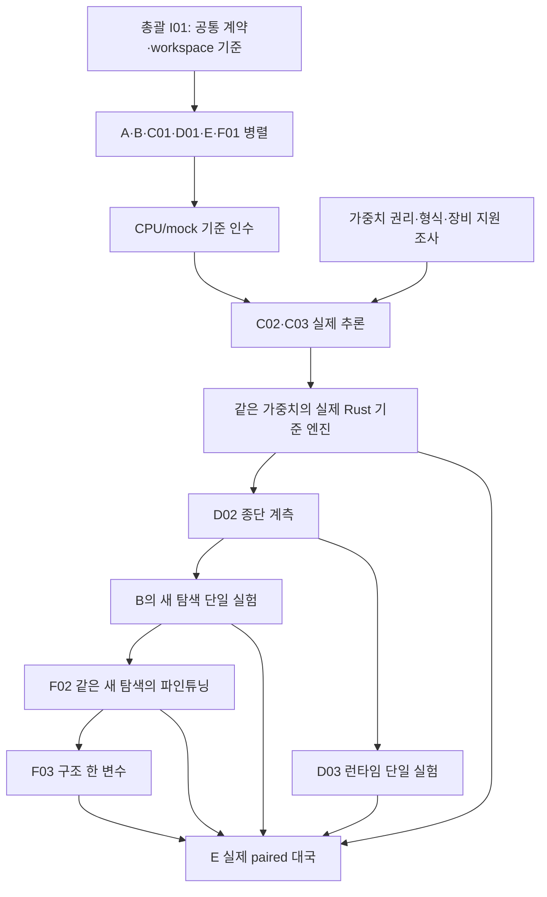

# RoveZero 구현 지시서

기준일: 2026-10-02. 이 문서는 사용자가 지정한 독립 Rust 엔진과 총괄·A~F 작업을
구현 단위, 의존성, 인수 조건으로 정의한다. 초기 작성은 지시서와 관련 문서를
준비한 작업이며 이후 구현 담당자는 사용자에게 배정된 TASK를 진행한다. 작성 시점에
실제 Cargo workspace·crates·CI·엔진·가중치 추론은 구현하거나 실행하지 않았다.
현재 상태는 작업 시작·재개 때 실제 저장소·원격 PR과 인수 기록으로 확인한다.

## 1. 지시의 우선순위와 총괄

사용자의 현재 지시가 [v0.2.0 핸드오프](reference/RoveZero_Handoff_v0.2.0_KO.md)의
권고보다 우선한다. 핸드오프 14~17장의 GPU 계측·단일 변수·후보 보존 원칙을 적용하되,
LC0를 포크하는 것으로 해석하지 않는다. 원문의 R0~R7은 연구 분류이고 아래 작업의 실제
착수 순서는 이번 사용자 지시를 따른다. [결정 기록](DECISIONS.md)에 변경 이유를 남긴다.

**총괄로 배정된 에이전트가 최소 공통 계약을 직접 소유한다.** 이 지시서는 총괄과
A~F 모두에게 적용하며 각 담당은 사용자 배정에서 자신의 역할을 확인한다. 총괄은
`Cargo.toml`, `Cargo.lock`, 공통 설정, CI, 실험 목록과 `crates/rz-contracts/`를 관리한다.
담당 A는 자체 규칙·상태를 구현하고 공통 계약을 적용한다. 다른 담당은 총괄의 계약을
소비하며 ID·오류·설정·요청·응답을 임의로 복제하거나 바꾸지 않는다.

공용 규약을 읽는 모든 에이전트가 총괄이 되는 것은 아니다. 초기 규약을 준비한
총괄 채팅의 배정·목표 일시중지 지시는 결정 기록에 보존하며, 재개 때의 원격 PR
확인 절차와 범위는 [AGENTS](../AGENTS.md)의 목표·일시중지·재개 규약을 따른다.

지시 ID는 `TASK-I01`, `TASK-A01`처럼 표시한다. 핸드오프 연구 후보는 `CARD-A01`,
`CARD-C02`처럼 표시한다. 예를 들어 **TASK-C02는 가중치 호환 구현**, **CARD-C02는
반복 잠재 추론 후보**다. 작업·후보 ID를 문서·커밋·실험에서 혼동하지 않는다.

## 2. 확정한 제품 경계

- 엔진의 규칙·UCI·탐색·추론 연결·런타임은 독립 Rust workspace에 구현한다.
  외부 체스 라이브러리는 제품의 규칙 코어 대신 독립 대조·테스트용으로 사용한다.
- 신규 자체 코드는 MIT 정책을 적용한다. 외부 코드·가중치·데이터·교사·오프닝·
  변환 도구의 권리는 각각 확인한다. 호환 구현을 이유로 타 엔진 코드를 번역·복사한 뒤
  MIT라고 표시하지 않는다. 외부 가중치를 MIT 소스와 한 라이선스로 묶지 않는다.
- 최소 PUCT는 자체 작성하는 첫 탐색 기준선이다. 최종 탐색을 고정한 결정이 아니다.
  초기 검증은 결정적인 mock 평가기로 하고, 실제 신경망 증거와 구분한다.
- 처음 지원할 한 종류는 Maia1 v1.0 `maia-1900.pb.gz`의 classical 112-plane·
  6×64 SE·convolution policy·WDL 형식이다. 권리·RTX 4050 6GB 자료상 적합성을
  조사해 선정한 호환·runtime 기준선이며 실제 수치·GPU 인수와 최종 강도용 모델은
  별도다. [선정 기록](WEIGHT-SELECTION.md)의 GPL 조건·인수 기준을 따른다.
  LC0 UCI 프로세스 호출만으로 Rust 신경망 API 구현을 완료했다고 보고하지 않는다.
- 학습 도구를 모두 Rust로 작성할지는 별도 결정이다. 기존 가중치의 미세 조정과
  입력·본체·출력 구조가 바뀌는 새 모델 연구를 구분한다.
- CPU 규칙·트리 제어와 GPU 평가를 함께 사용할 수 있다. 모든 계산을 GPU로
  옮기는 것을 목표로 삼지 않는다. 정확한 규칙을 잠재 모델로 대신하지 않는다.

### 2.1 클라우드 개발과 GPU 인수

A~F의 개발 환경은 GPU가 없을 수 있는 클라우드다. **개발 호스트의 capability와 별도
지정한 GPU에서의 실제 검증을 분리한다.** 초기 RTX 4050 6GB 인수 이력은 보존하고,
후속 GPU 벤치마크는 [외부 RunPod 준비 계획](research/RUNPOD-BENCHMARK-PLAN.md)을
따른다. GPU·예산·보존 조건은 선택 전까지 미결정이다. 착수 때 필요한 OS·toolchain·CPU/RAM·
저장 공간과 실제 장치/provider 접근을 확인해 available/unavailable/unknown으로 기록한다.
GPU가 없으면 CPU/mock 기본 조합으로 배정 작업을 계속한다. 실제 CPU 신경망 수치 대조는
backend를 명시한 별도 증거이며 mock 또는 GPU 추론 증거와 혼합하지 않는다.

| 담당 | GPU 없는 클라우드에서 먼저 제공할 결과 | 별도 지원 환경에서 인수할 결과 |
|---|---|---|
| 총괄 I | 최소 계약·workspace·CPU/mock CI·통합 명령·검증 인계 명세 | 정확한 SHA와 같은 설정의 목표 GPU·학습·대국 인수 기록 |
| A | 자체 규칙·perft·이력·복원·계약 적용 검사 | A의 정확성 검사는 GPU를 요구하지 않음 |
| B | mock PUCT·인공 트리·UCI·시간·취소·합법 fallback·교체 경계 | 실제 신경망 탐색 연결과 같은 자원에서 새 탐색 효과 |
| C | C01, C02 로더·인코딩·mapping, 가능한 CPU 수치 대조, C03 provider 코드·검사 진입점 | 실제 목표 GPU loading·batch·warm-up·수치·메모리·취소 수명 |
| D | D01, D02 CPU/mock trace·계측 도구, D03 baseline/variant 전환·정확성 검사 | 목표 GPU 전체 경로 D02와 같은 W·S·자원의 D03 개선 |
| E | manifest·fixture·CPU 외부 runner·pair·실패·PGN·통계 검사 | 잠긴 예산·같은 장비와 조건의 정식 paired 대국 |
| F | F01, F02 recipe·export·resume 검증 도구, F03 한 변수 구현·CPU 검사 | 실제 데이터 생성·학습·checkpoint 및 같은 탐색의 강도 비교 |

총괄 I02는 소스 제공·CPU/mock 통과·실제 CPU 수치·실제 목표 GPU·학습·대국을 별도로
기록한다. 지원 환경의 검증자에게 commit SHA·계약 revision·명령·설정·fixture/입력 식별·
자원 상한·기대 기준·기실행/미실행 결과를 인계한다. 클라우드의 GPU 부재로 skip된 검사는
미실행이며 C03/G2의 GPU 부분, D02/D03의 GPU 효과, F02의 실제 학습 인수는 남아 있다.
코드 인수를 실제 실행 완료로 바꾸지 않는다. 같은 조건의 증거가 없으면 CPU/mock 성공을
GPU 통과로 재사용하지 않는다. GPU provider 실패를 CPU로 조용히 대체하지 않는다.

CPU 전용 기본 빌드에 CUDA 설치를 강제하지 않는다. 독립 클라우드의 생성물은 저장소 밖
작업 전용 루트·보존/회수 정책을 정해 둔다. 실제 GPU 실행은 이미 배정된 장비·예산에서
진행하며 새 유료 GPU나 범위를 넘는 장시간 실행은 필요한 자원·비용을 먼저 확정한다.

## 3. 총괄의 최소 공통 계약 공개

총괄은 [CONTRACTS](CONTRACTS.md)를 기준으로 최초 계약 revision을 정의하고,
구현 착수 시 `rz-contracts`에 반영한다. 공통 계약의 내용과 실제 Rust 선언이 다르면
총괄이 소비자 영향·검사를 확인해 두 문서를 함께 갱신한다.

최소 범위는 다음과 같다.

1. 상태·모델·인코딩·합법 수 목록의 식별자, 요청·게임·root generation, 계약 revision.
2. 정규화된 수와 네 승격 종류, 합법 수 순서와 목록 식별. 모델의 전체 policy index는
   이 계약에 고정하지 않고 C의 모델별 mapping이 합법 수 벡터로 변환한다.
3. 평가 요청·응답, side-to-move 관점의 WDL·policy 기본 계약, 완료·취소·실패 구분.
   외부 모델의 관점은 C가 명시적으로 변환한다. Tensor·백엔드 타입은 공통 API에 노출하지 않는다.
4. monotonic deadline, 유한 batch·queue·메모리·반복 예산과 입력 검증의 책임.
   프로세스 밖 deadline은 자체 해석 가능한 상대 예산으로 전달하며 wall-clock 시각을 섞지 않는다.
5. 공통 오류 분류·원인·요청 문맥, evaluator 접점과 mock 정상·지연·실패 시나리오.
6. 규칙 상태와 평가 입력 식별의 차이, 정확 캐시·근사 잠재 상태·edge 통계의 별도 소유권.

공통 계약에는 모델 로딩·GPU 커널·탐색·규칙 구현을 넣지 않는다. async 요청이 mutable
Position의 빌린 메모리를 수명 밖에서 읽지 않도록 불변 snapshot·소유 buffer·검증한 handle
중 명시한 방식을 사용한다. 계약 변경 요청에는 변경 이유·소비자·호환성과 인수 벡터를
적는다. 총괄이 revision을 갱신하고 필요한 소비자 검사를 묶어 통합한다.

첫 계약이 공개되면 A·B·C01·D01·E·F01은 mock·fixture를 사용해 병렬 개발한다.
규칙이나 신경망 전체 완성을 기다리며 빈 구현으로 결과를 꾸미지 않는다.

## 4. Workspace와 의존 방향

아래는 사용자가 지정한 구현 경로다. 이번 문서 작업에서 빈 crate를 미리 만들지는 않는다.

| 경로 | 소유자 | 내부 의존 방향과 경계 |
|---|---|---|
| 루트 Cargo 파일·공통 설정·CI·실험 목록 | 총괄 | 전체 feature·toolchain·target·자원 설정, lockfile과 통합 명령 |
| `crates/rz-contracts/` | 총괄 | backend·position·search·runtime에 의존하지 않는 최소 공통 계약 |
| `crates/rz-position/` | A | 자체 규칙·상태; 필요한 공통 primitive는 contracts를 소비하고 역의존 금지 |
| `crates/rz-search/` | B | position·contracts, 주입한 evaluator 접점; 구체 backend·model loader 의존 금지 |
| `crates/rz-uci/` | B | position·search·runtime을 조합하는 실행 경계; 진단과 프로토콜 분리 |
| `crates/rz-encoding/` | C | position·contracts를 선택한 모델 입력·policy mapping으로 변환 |
| `crates/rz-eval/` | C | contracts·encoding 및 선택 backend; 규칙·착수·대국 판정 소유 금지 |
| `crates/rz-runtime/` | D | contracts의 evaluator 접점·큐·batch·수명; 모델·search 의미 재구현 금지 |
| `crates/rz-telemetry/` | D | 수동적 이벤트·계측 계약; 관측 때문에 규칙·backup 결과를 변경하지 않음 |
| `benches/runtime/` | D | 고정 설정의 baseline/variant·trace 측정; 원시 로그는 외부 생성물 루트 |
| `crates/rz-experiments/` | E | 실행 명세·digest·실험 식별·결과 provenance; 누락 조건 검증 |
| `crates/rz-arena/` | E | 외부 runner 연결·pair·PGN·결과 통계; 후보 엔진 자체 판정을 유일 근거로 삼지 않음 |
| `experiments/baselines/` | E | 작은 재현 설정·잠긴 baseline manifest; binary·가중치·PGN 묶음 제외 |
| 데이터 계약·학습 도구·`experiments/model-research/` | F | F01~F03; 도구 언어·구체 패키지는 별도 결정, engine 규칙 재구현 금지 |

Runtime이 evaluator를 주입받으면 mock과 실제 평가기를 같은 계약으로 교체한다.
구체 provider의 조합은 UCI/bootstrap에서 하고 search↔runtime↔eval 순환 의존을 만들지
않는다. 이벤트·입력 타입은 한 소유자가 관리한다. 소스 줄 수로 crate를 추가하지 않는다.

## 5. 20개 작업과 인수 조건

### 총괄: 공통 기반과 통합

**TASK-I01 — Rust workspace와 소유 경계.** 루트 Cargo 파일, MIT 코드·외부 자산 경계,
toolchain·feature·설정·오류·ID와 최소 공통 계약을 정의한다. CPU/mock 기본 빌드가
GPU 설치 없이 동작하도록 구체 backend를 분리한다. 실제 Cargo 선언이 만들어지면
허용 의존 방향·workspace 구성·lockfile 재현을 확인한다. 모든 소비자가 같은 계약 revision을
사용하고 순환·제품 규칙용 외부 체스 라이브러리 의존이 없으면 기반 인수 조건을 충족한다.

**TASK-I02 — 단계별 통합과 인수.** 각 작업의 WIP/final SHA, 계약 revision, 설정,
검사·실험·실패·미실행 근거를 모은다. CPU/mock, 참조 수치, 실제 목표 GPU,
대국의 결과를 별도 계층으로 관리한다. 동일 설정으로 조합을 빌드·실행하고 이전 검증
조합으로 복구할 수 있어야 한다. 실패 변경은 공유 이력을 강제 재작성하지 않고 후속
수정·revert 또는 baseline/variant 전환으로 분리한다.

### A: 체스 규칙·상태·공통 계약 적용

**TASK-A01 — 자체 체스 코어.** 내부 순서는 board·piece 표현 → attacks → pseudo-legal
moves → king safety filter → make/unmake다. 공격 판정과 합법 착수를 혼동하지 않는다.
킹 포획을 수로 생성하지 않고, 핀·더블 체크·앙파상의 발견 공격과 캐슬링 통과 칸을
검사한다. 캐슬링·앙파상·Q/R/B/N 승격은 작은 독립 검증 단위로 나눈다. 독립 perft와
divide를 대조하고 첫 차이의 move/path를 보존한다. 같은 자체 갱신 코드를 호출하는
대조만으로 규칙 정확성을 입증하지 않는다.

**TASK-A02 — 이력·종료·키.** 규칙용 repetition identity, halfmove/fullmove counter,
checkmate/stalemate, claimable/automatic draw를 구분한다. FEN-only 입력의 과거 이력은
unknown으로 보존한다. [CONTRACTS](CONTRACTS.md)의 draw profile과 단위에 맞추며
claim policy는 대국 실행 전 runner와 일치시킨다. 보드가 같지만 차례·권리·이력·카운터가
다른 상태와 긴 make/unmake 후 완전 복원으로 검사한다. 규칙 키를 모델 입력 캐시 키로 쓰지 않는다.

**TASK-A03 — 평가 요청·응답 계약 적용.** 총괄이 소유한 최소 계약에 상태 snapshot,
합법 수의 정확한 순서·승격·출력 관점·세대·마감을 연결한다. A는 position 관련 적용과
검증을 담당하고, 공통 선언·오류·revision은 총괄이 관리한다. C와 모델별 mapping을
대조하되 구체 encoder를 공통 API로 끌어오지 않는다. 최초 계약 이후 mock 병렬 작업을
허용하고 적용 오류·원본 상태 보존·수명 벡터를 통과해야 한다.

### B: UCI·탐색·시간 제어

**TASK-B01 — UCI 실행 수명주기.** `uci/isready/position/go/stop/quit/ucinewgame`과
옵션 검증을 구현한다. stdout은 UCI 프로토콜, 진단은 stderr 또는 별도 계측 경로다.
중복 stop, 잘못된 FEN·수·옵션, 실행 중 quit·새 position·새 게임의 순서를 검사한다.
미지원 명령·옵션과 malformed 입력의 처리 정책을 명시하고 실패한 position 전이는
원본 상태를 보존한다. CLI의 UCI 입출력 성공과 신경망 구현 성공을 구분한다.

**TASK-B02 — 최소 탐색 기준선과 교체 경계.** 자체 PUCT selection·expansion·backup·
visit accounting과 정확한 terminal 처리를 작성한다. deterministic mock과 작은 인공
트리의 수동 기대값으로 가치 관점·방문·선택을 대조한다. 기준 search와 새 policy의
전환을 제공하고 algorithm/config ID를 기록한다. cache lookup 자체로 방문을 만들지
않으며 새로운 유효 traversal의 결과만 한 번 backup한다. 새 policy는 최종 알고리즘으로
고정하지 않고 같은 가중치·시간의 별도 S 실험으로 검증한다.

최초 CPU/mock 검색은 아래의 결정적인 도입 기본안으로 구현한다. 변경한 값과
방문 정의는 search config/revision으로 식별한다. 이 식은 LC0의 탐색을 복제한
명세가 아니며, 성능 튜닝은 실제 기준선 인수 이후 별도 S 실험이다.

| 항목 | 최소 기준선의 정의 |
|---|---|
| 선택 | parent 관점 edge에서 `score(a)=Q(a)+c_puct*P(a)*sqrt(max(1,N_parent))/(1+N(a))`; `N_parent=sum_a N(a)`. 첫 기본값 `c_puct=1.5`, 미방문 edge의 FPU `Q=0` |
| 값·backup | leaf 실제 차례의 `v=W-L`, draw utility 0. 한 실제 ply마다 부호를 반전해 해당 parent edge의 W에 더한다. `Q=W/N`이며 유효 selection의 각 경로 edge N을 한 번 증가시킨다 |
| 최초 root 평가 | 합법 수와 prior를 준비하는 초기화다. root edge를 통과하지 않은 초기 평가 자체에는 edge 방문을 부여하지 않는다 |
| 확장·종료 | checked 상태의 terminal을 먼저 처리하고 NN 요청 없이 승/무/패 utility를 사용한다. 비종료 leaf만 평가해 중복 없는 합법 edge를 한 번 확장한다. 정확한 상태·이력별 종료를 board-only TT로 합치지 않는다 |
| 결정성 | root noise·random rollout은 끈다. 선택 score 동률은 공통 ordered legal move 순서로 해결한다. mock script·seed·float 비교 정책을 고정한다 |
| 첫 실행 형태 | 단일 search worker·동시에 하나의 유효 selection으로 시작한다. async queue·취소 계약은 유지하고, 병렬 selection·virtual loss·dedup은 D01 연결 시 독립 검증한다 |
| root 착수 | 완료된 유효 edge의 N이 가장 큰 수, 동률이면 Q와 공통 수 순서를 사용한다. 완료 방문이 없으면 이미 검증해 둔 합법 fallback을 반환한다. fallback 사용·평가 실패를 진단에 기록한다 |
| 실패·중단 | 실패·취소·만료 selection은 W/N에 반영하지 않고 예약만 해제한다. stop 뒤에는 마지막 유효 착수만 출력하며 double backup·늦은 root 반영을 차단한다 |

작은 인공 트리의 손계산 참조에는 child WDL `(0,0,1)`의 한-ply backup `+1`,
`(1,0,0)`의 `-1`, draw의 `0`, 두-ply 부호 복원, terminal 선행 처리, 선택 동률,
완료/실패/중복 callback별 N/W·예약 변화가 포함된다. 동일 cached 평가를 새로
선택한 유효 경로 두 개가 쓰면 network execution 1·accepted backup 2가 가능하지만,
한 selection의 두 callback은 accepted backup 1이어야 한다. 실제 구현을 호출해서
그 결과를 기대값으로 만드는 검사 대신 독립 손계산·fixture로 대조한다.

**TASK-B03 — 시간 예산·취소·안전한 착수.** movetime과 clock+increment를 분리한다.
deadline에 마지막 유효 합법 착수를 반환하고, 늦은 결과·root/game 교체·중복 stop의
영향을 막는다. 유효 착수가 하나도 없는 terminal 상태와 내부 오류를 구분한다.
queue/drain·GPU 취소 불가 구간·출력 여유도 자기 시간 비용이며 0점이나 무승부로
실패를 숨기지 않는다. 실제 clock 설정은 실행 manifest에서 확정한다.

### C: 가중치 호환·신경망 추론

**TASK-C01 — Mock evaluator와 오류 주입.** 같은 계약에서 정상·지연·실패·취소 race·
순서 변경·부분 완료·비정상 수치를 재현한다. seed·script·request ID를 기록해 재현하고
search/runtime이 GPU 없이 개발·검증할 수 있게 한다. mock 성공은 실제 모델·GPU 지원의 증거가 아니다.

**TASK-C02 — 선택한 가중치 한 종류의 호환 구현.** [선정 기록](WEIGHT-SELECTION.md)의
단일 형식·구조·head를 명시한다. 입력 이력·history-fill·차례 canonicalization·좌표,
policy index·네 승격 mapping, value/WDL 의미와 정밀도를 독립 참조에 대조한다.
가중치의 읽기·변환·학습·배포 권리와 변환 도구 권리는 별도로 확인한다. 지원하지 않는
형식은 거부하고 모든 LC0 네트워크를 범용 지원한다고 선언하지 않는다.

**TASK-C03 — 실제 추론 backend 연결.** 선택 장비에서 loading·batch·warm-up·동기화·
오류를 연결한다. 독립 참조의 동일 입력·합법 수별 policy·WDL과 선언한 허용 오차를
만족해야 한다. batch 1과 실제 search 분포, 메모리 상한·NaN/Inf·실패·취소 수명을 확인한다.
독립 수치, 같은 GPU의 실제 실행과 RoveZero 탐색 연결은 각각 다른 증거다.
GPU 없는 클라우드에서는 provider 연결 코드·명시적 CPU 참조·재현 fixture와 GPU 검사
명세를 먼저 인계할 수 있다. 실제 목표 GPU 검사가 남아 있으면 C03 전체 완료나 G2 통과로
표시하지 않고 실행하지 못한 검사를 총괄 I02의 지원 환경 인수 항목으로 남긴다.

### D: 평가 런타임·계측·최적화

**TASK-D01 — 단순하고 정확한 요청 처리.** bounded queue, 기본 batch, request/state
generation, deadline·취소·in-flight 예약/해제를 구현한다. 정확한 raw eval namespace와
edge 통계를 분리한다. 최초 기준에 speculation·warm-start·동적 반복을 넣지 않는다.
duplicate·stale·canceled 결과의 게시/backup과 GPU buffer 수명을 mock race로 검사한다.

**TASK-D02 — 종단 프로파일링.** CPU 준비·queue·전송·GPU 완료·backup·출력까지
monotonic 시간으로 잰다. P50/P95/P99, batch 분포·메모리, 고유 평가·실제 소비 평가·
취소·중복·미사용 작업을 별도로 기록한다. pipeline 중첩 시간을 단순 합한 값을 처리량으로
사용하지 않는다. cold/warm·parent/child·sibling·transposition·eviction·긴 trace를 나눈다.

**TASK-D03 — 측정으로 고른 개선 한 가지.** 같은 RoveZero 모델·가중치·search·자원에서
batch/queue, 정확 캐시, dedup, memory layout 중 하나만 변경한다. baseline/variant를
전환하고 수치·수명 회귀 없이 전체 지연 또는 유효 평가량의 개선을 확인한다. CPU mock의
속도·커널 하나의 속도·실제 대국 강도를 혼합하지 않는다. search 변경은 B의 별도 실험이다.

### E: LC0 비교·대국·통계

**TASK-E01 — 재현 가능한 실행 명세.** [EVALUATION-PROTOCOL](EVALUATION-PROTOCOL.md)의
version·binary/weight digest·search/backend/precision/options·장비·seed·opening·
clock·runner·statistics·budget 필드를 잠근다. 필수 정보가 없거나 digest가 다른 결과는
정식 비교 집합에 넣지 않는다. `latest`·파일명·원격 branch 이름만으로 식별하지 않는다.

**TASK-E02 — 흑백 교대 paired 대국.** 같은 완전 시작 상태에 엔진 배정만 교환해
두 판을 pair로 묶는다. 기존 외부 runner와 전체 PGN으로 상태·색·시계·실행 순서를
재확인한다. RoveZero 구현 전에도 fixture·외부 엔진으로 runner를 개발할 수 있지만
그 성공을 RoveZero 경기 결과로 표시하지 않는다.

**TASK-E03 — 실패 정책과 결과 집계.** 엔진 불법 수·crash·시간패, 인프라 장애,
미완료·취소를 구분한다. WDL·득점률·pair 빈도와 사전 통계·중단·무효 재실행 정책을
보존한다. 실패 판을 선택적으로 빼거나 미완료를 0.5점으로 만들지 않는다. 실제 경기 수·
time control·GPU 점유와 통계 threshold는 첫 결과 전에 확정한다.

### F: 데이터·파인튜닝·후속 아키텍처

**TASK-F01 — 학습 데이터 계약과 누출 검사.** [TRAINING-PLAN](TRAINING-PLAN.md)의
완전 상태·이력, search version/budget, ordered policy/value target·관점, 실제 결과·
종료 이유·teacher provenance를 정의한다. game/opening 단위 split과 중복·transposition
누출 검사를 준비한다. CPU/mock으로 데이터 구조를 검증할 수 있으나 실제 교사 분석으로
라벨 품질이 확인된 것은 아니다. 최소 계약 이후 다른 담당과 병렬 개발한다.

**TASK-F02 — 새 탐색에 맞춘 파인튜닝 경로.** 권리가 확인된 원본 가중치로 데이터
생성 → 학습 → 평가 → checkpoint resume/reproduce를 연결한다. 원본은 보존하고
변경 가중치·optimizer·seed·split·budget·search label 생성 조건을 식별한다. 실제 학습은
장비·유한 비용·가중치 권리 확정 후 실행한다. 같은 새 search에서 원본과 fine-tuned
weight를 비교해 search와 training gain을 구분해야 인수할 수 있다.

**TASK-F03 — 새 모델 구조의 단일 변수 실험.** 관계 입력·latent·recurrent·warm-start
중 하나씩 비교한다. 기존 가중치와 구조가 맞지 않으면 부분 초기화·증류·별도 학습의
독립 과제로 기록한다. [후보 등록부](CANDIDATE-REGISTER.md)의 76개를 한 모델에
동시에 넣지 않는다. 같은 데이터·학습 budget·search와 fresh 기준을 두고 tail 전술·
경로 의존·deadline·상주 메모리·전체 시간을 검증한다. 결합 시 제거 ablation을 수행한다.

## 6. 착수 순서와 병렬 인수

총괄은 계약 초안과 interface WIP를 먼저 공유한다. A의 모든 perft, C의 GPU 추론,
E의 실제 경기 완료를 초기 병렬 작업의 선행 조건으로 만들지 않는다. 실제 통합 인수에는
필요한 앞 단계의 계약·정확성·자원 근거가 있어야 한다. 단계 완료와 연구 후보 승격은 다르다.
GPU 없는 클라우드의 소스·CPU/mock 부분 인수는 계속 진행한다. 실제 GPU 인수는 지원
환경에서 별도로 수행하며 개발 담당 전원에게 GPU 할당을 요구하는 병렬 착수 조건을 만들지 않는다.

| 통합 단계 | 총괄의 필수 인수 근거 | 이 근거로 주장하지 않는 것 |
|---|---|---|
| G0 공통 기반 | 계약 revision·공통 설정·의존 방향·CPU/mock 조합 | 엔진 완성·GPU 지원 |
| G1 규칙·mock 기준 | independent perft/divide·복원·인공 트리·UCI/cancel·데이터 계약 | 실제 신경망 수치·대국 강도 |
| G2 실제 Rust 기준 | 단일 weight 권리·입력/policy/WDL parity·실제 목표 backend·상한 내 실행 | LC0보다 강함·최적화 성공 |
| G3 계측·단일 변경 | D02 전체 경로, 동일 weight/search의 D03 또는 동일 weight의 새 search | 다른 원인의 gain·모델 승격 |
| G4 파인튜닝 | 같은 새 search의 원본/fine weight, checkpoint·split·비용 재현 | 구조 변경의 gain |
| G5 구조·결합 | 독립 holdout, 단일 구조·full/fresh·tail/deadline·ablation·실제 paired 결과 | 미실행 장비·모든 후보의 성과 |

## 7. 변경의 효과를 분리하는 실험

| 실험 조합 | 가중치 | 탐색 | 무엇을 비교하는가 |
|---|---|---|---|
| CONTROL-0 | 원본 고정 W0 | 자체 기준 PUCT S0 | RoveZero 내부 기준 |
| CONTROL-1 | 같은 W0 | 새 탐색 S1 | CONTROL-0 대비 탐색 변경 효과 |
| CONTROL-2 | 파인튜닝 W1 | 같은 S1 | CONTROL-1 대비 학습 변경 효과 |

CONTROL-0→1에서 encoder·precision·runtime·메모리·시간을 고정한다. CONTROL-1→2도
가중치와 사전 학습 조건 외 비교 조건을 고정한다. D03 runtime baseline/variant는 같은
W·S에 대해 별도 축으로 실행한다. 세 조합의 수치 오차·실패·설정과 실제 wall-clock을 남긴다.

LC0와의 equal-time 대국은 외부 성능 비교다. 내부 A/B와 별도로 기록하며 LC0와
RoveZero의 search·net·backend가 다른 경우 차이를 명시한다. 내부 microbenchmark나
mock 개선으로 LC0 대비 Elo를 주장하지 않는다. 서로 다른 조건의 Elo를 합치지 않는다.

## 8. WIP 공유·변경 인수·복구

작은 의미 단위마다 커밋·push하고 장기 작업은 15~30분마다 진행 변경을 공유한다.
미완성·빌드 실패도 WIP로 공유하되 상태를 명시한다. 총괄은 같은 목표의 작업을 추적하고
공유 이력을 커밋 개수에 맞추기 위해 재작성하지 않는다. [기여 절차](../CONTRIBUTING.md)를 따른다.

인수 기록에는 TASK ID, 담당, commit/기준 diff, 계약 revision, 설정·feature·입력·seed,
실제 검사와 결과, 필요한 다음 작업, artifact 논리 경로·digest, 미실행·실패 범위를 적는다.
원격·workspace가 아직 없으면 SHA를 꾸미지 않고 문서 또는 해당 diff 상태로 기록한다.

총괄은 실패의 유형·원인·영향을 먼저 확인하고 이미 성공한 독립 영역을 보존한다.
계약 변경은 영향 소비자만 재검증한다. runtime·search·weights 전환에는 이전 검증
조합을 식별하는 설정을 남긴다. 복구는 새로운 revision·실험 ID로 기록하고 실패를 지우지 않는다.

## 9. 실행 전 잠금과 중단

현재 문서는 구현을 시작할 수 있는 책임·계약·순서를 정의한다. 실제 외부 변경·
가중치 다운로드·장시간 실행은 그 작업의 사용자 요청 범위를 따른다. 이번 가중치 선정
조사와 표적 메타데이터 검사는 사용자가 요청했으며 실제 GPU 시험·학습과 구분한다.

| 잠글 것 | 잠금 시점 |
|---|---|
| Rust toolchain·target·CPU/mock 명령·feature·lockfile·CI | TASK-I01 소스 도입 시 |
| weight 형식·구조·입출력·권리·참조 도구·backend·허용 오차 | TASK-C02/C03 실제 연결 전 |
| CPU/RAM/VRAM·queue/batch·worker·deadline/drain·실행 시간/비용 | 실제 추론·profile·학습·대국 전 |
| runner·draw claim/adjudication·tablebase·시계·opening·pair/seed | TASK-E 실제 비교 전 |
| split·teacher·label·loss/optimizer·seed·train budget·resume 기준 | TASK-F02 실행 전 |
| 표본·검정·최소 효과·CI/승격·중단·무효 재실행·보존 정책 | 첫 실제 비교 결과 전 |

의미 보존 불일치, 잘못된 cache 공유, double backup, WDL 관점 오류, 자기 시간 밖
계산, 필수 manifest 누락, 미지원 net, 권리 미확인, 메모리 상한 위반은 해당 단계 인수를
중단한다. CPU/mock 등 독립 작업은 계속할 수 있다. 실패를 타 엔진 호출·임의 backend·
조용한 batch 축소·가짜 무승부로 대체하지 않는다.

## 10. 핸드오프 반영 위치

| 핸드오프 영역 | 구현 지시의 주 문서 |
|---|---|
| 1장 목표·결정, 14~17장 개정·선행 측정 | 이 문서 1~2·5~7장, [DECISIONS](DECISIONS.md) |
| 3~4장 비용·책임·상태·평가·캐시 | [ARCHITECTURE](ARCHITECTURE.md), [CONTRACTS](CONTRACTS.md) |
| 2장 시간·pair·실패·통계, 11장 계측 | [EXPERIMENTS](EXPERIMENTS.md), [EVALUATION-PROTOCOL](EVALUATION-PROTOCOL.md) |
| 10장 학습·누출·잠재 보정, 12장 인수 | [TRAINING-PLAN](TRAINING-PLAN.md), 이 문서 5~6장 |
| 5~9·16장 모든 후보와 18장 출처 | [CANDIDATE-REGISTER](CANDIDATE-REGISTER.md), 보존 원문 |
| 가중치 한 종류의 권리·장비·호환 선택 | [WEIGHT-SELECTION](WEIGHT-SELECTION.md) |

보존 원문을 구현 완료 기록으로 바꾸지 않는다. 외부 구현·저자 보고·하드웨어 추론,
문서 수락·CPU/mock·실제 추론·대국·배포를 각각 분리해 보고한다.
