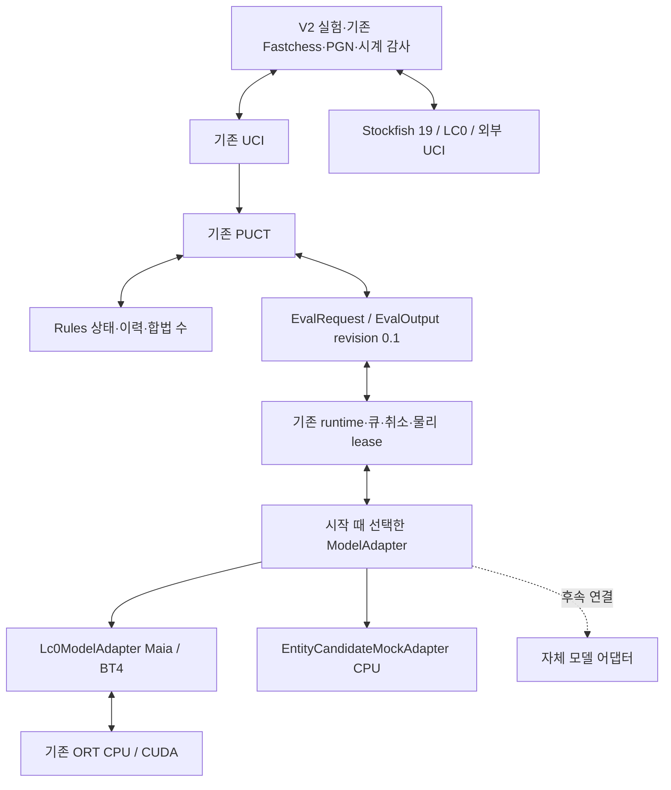

# 모델 어댑터와 외부 UCI 교체 경계

PR #20 통합 `9e450d5325a51b570e72472efd54368a36dab81b`를 분리 전 기준으로 등록한다.
작업은 `feature/model-adapter-external-uci`와 Draft PR #22에서 공유한다. 공통 평가 계약
revision `0.1`, Rules, PUCT, runtime의 취소·세대·물리 수명은 유지한다. 구현 제공,
CPU 검사, 실제 신경망 수치 검사, 성능 회귀, 외부 대국은 별도 인수다.

## 5% 기준의 적용 범위

2026-10-07 사용자 정정에 따라 **현재 모델 어댑터·외부 UCI 통합 작업의 등록·진행에는
5% 조건을 적용하지 않는다.** 이 기준은 의미 변화가 없는 자료형·레이아웃·소유권 표현
변경 등 리팩터링의 성능 회귀를 따로 평가할 때 사용하는 기준이다. 비교 이름이
AdapterEquivalence 또는 분류가 E라는 이유만으로 현재 통합 전체에 자동 적용하지 않는다.
대상 변경과 고정 조건을 명시한 별도 리팩터링 A/B에서만 시간·peak의 5% 문턱을 선택한다.

A/A의 시간·메모리 편차는 환경 변동을 설명하는 관측값이다. 5%를 넘었다는 이유만으로
비교 등록·A/B 실행·외부 엔진 연결을 차단하지 않는다. InternalWeights·InternalModel·
InternalSearch·ExternalEngine의 모델·탐색·기력 차이를 이 문턱으로 판정하지 않는다.
기존 E 최적화의 [메모리·속도 상충 채택 기준](research/MEMORY-EXECUTION-OPTIMIZATION.md#adoption-gate)은
해당 의미 보존 변경의 효과 인수에 적용하며 현재 통합의 일반 등록 조건으로 확대하지 않는다.

후속 recipe는 `--acceptance-scope=integration_observation`을 명시한다. 시간·peak·쌍별
비율·같은 조건의 합계를 보존하되 `performance_acceptance=not_applicable`로 남긴다.
완료된 측정의 `status=passed`는 작업량·결과·물리 수명·증거가 유효하다는 뜻이며 성능
회귀 없음의 선언이 아니다. 별도 리팩터링은 `semantic_preserving_refactor`를 선택하고
각 A/B 쌍에 T_B/T_A≤1.05 및 P_B/P_A≤1.05를 적용한다. 두 범위 모두 A/A 편차는 gate가 아니다.

기존 원시 자료·등록·HOLD·도구 SHA는 당시 판정 이력으로 보존한다. 적용 범위 정정만으로
실행하지 않은 A/B나 Stockfish 대국을 통과로 바꾸지 않는다. 입력·작업량·수치·물리 완료·
할당·종료·정리 검사는 계속 요구하고 유한 실행 예산은 별도 조건으로 유지한다.

범위 분리 도구 `fe355dc`의 CPU recipe는 WSL Python 3.12.3에서 62개 통과했고 Windows
Python 3.14에서 58개 통과·Linux 전용 4개 미실행이었다. A/A 8% drift 뒤에도 통합 A/B를
수집하는 경로, 별도 리팩터링의 쌍별 5% 초과 거부, 범위 혼합·미지정 거부, 진단·작업량·
수명 실패 거부를 mock으로 확인했다. Windows Python 3.10의 첫 검사는 기존
`Path.is_junction` API 부재로 실패했으며 지원 버전 결과와 구분한다. 이 CPU 검사는
실제 GPU 측정·새 A/B·Stockfish 대국 증거가 아니다. 새 CI의 실행 SHA·상태도 별도로 기록한다.

## 제품 경계

`rz-eval::model_adapter::ModelAdapter`의 준비 입력·batch·raw 출력은 associated type이다.
모든 모델에 LC0의 112×64 입력이나 1858 policy 배열을 강제하지 않는다. Rules 상태·
이력·합법 수에서 실제 입력 식별값을 계산하고, 출력은 요청의 합법 수 **순서** policy와
차례 관점 WDL로 검사·변환한다. 선언된 자원 예약과 실제 peak/할당 한도를 구분한다.

`adapters/lc0/`가 입력 이력·좌표·승격 policy·softmax·head/shape·자산 검증·모델별
session 조건을 소유한다. Maia1900와 BT4-it332 프로필을 포함한다. 기존 공개 경로와
`ClassicalProjection` 별칭은 호환용으로 유지하며 코드 이동으로 의미 hash를 바꾸지 않는다.
구현 출처는 V2 `adapter_implementation_sha256`와 binary/source pin으로 별도 기록한다.

`NativeWorkerOwner<A>`와 `NativeRuntimeBackend<C,A>`를 준비 batch 타입에 대해 일반화한다.
bootstrap 한 번에 모델을 선택하며 노드마다 목록 조회나 입력 추가 복제를 하지 않는다.
기존 단일 물리 worker·lease, deadline·generation·예약·취소, 완료 후 buffer 재사용과
불명 완료 격리를 유지한다. 논리 취소가 session·입력·출력의 해제 권한을 주지 않는다.
스트리밍 검증, 직렬화 버퍼 조기 해제, 공유 runtime cache, 기존 독립 buffer 옵션,
snapshot cache hint와 저장소 정리 조건을 보존한다.

`EntityCandidateMockAdapter`는 entity·상태·known history·순서 있는 합법 후보에서
후보 수만큼의 logits와 WDL을 반환한다. 후보·mask·순서·네 승격·이력은 입력 식별에
포함되며 준비 입력은 외부에서 변경할 수 없다. CPU mock은 **B1만** 허용하고 LC0 raw
head 재사용/서로 다른 후보 목록의 batch 권한을 상속하지 않는다. 실제 자체 신경망이나
강도 결과가 아니다. `--cpu-mock --model-adapter=entity-candidate-mock`으로 기존 UCI·
runtime·탐색을 통과한다. 기존 mock/native CLI 기본값은 LC0다.

캐시 키는 실제 입력·이력·모델·encoding·backend·정밀도를 구분한다. 후보가 입력이면
후보·mask·순서도 포함한다. 기존 LC0 전체 raw head 재사용·요청별 합법 수 투영은 유지한다.
cache hit, 물리 NN 입력 완료, 탐색 소비 평가와 방문을 구분한다.

## V2 비교 명세

`RunManifestV2`와 `LockedManifestV2`는 별도 codec/domain이다. V1 parser·canonicalization·
digest·기록을 자동 변환하지 않는다. V2 lock도 `execution_ready=false`이며 메타데이터
잠금 자체가 실행·검증 성공을 뜻하지 않는다.

| 비교 | 고정·허용 변화 | 분류 |
|---|---|---|
| Runtime | 모델 구성·weights·입력·탐색·backend·정밀도 고정, 선언한 runtime·공개 환경 변화 | E |
| AdapterEquivalence | 모델·입력 의미·runtime·탐색·backend·정밀도·batch 고정, 어댑터 구현/연결만 변화 | E |
| InternalWeights | 동일 실행 파일·구조·encoding·head·adapter 의미·backend·정밀도·탐색·runtime, weights만 변화 | A |
| InternalModel | Rules·평가 절차·탐색·runtime·시계·자원 고정, 모델 구성과 필요한 실행 차이를 사전 선언 | A |
| InternalSearch | 모델·weights·runtime 고정, 선언한 탐색 변화 | S |
| ExternalEngine | 완전 시작 상태·색 교환·시계·실패·집계 고정, 양쪽 엔진·옵션·자산·자원 차이를 기록 | 외부 비교 |

Runtime·InternalSearch 코드 실험과 adapter/model 비교에는 다른 실행 파일이 필요할 수
있다. target·compiler·build mode·ISA는 고정하며 실제 변경 집합과 `declared_changes`를
대조한다. InternalModel은 선언한 구성 전체의 효과다. 개별 요소에는 별도 통제 비교가
필요하다. batching은 S 실험이며 현재 V2 native 실행 recipe는 기존 B1을 사용한다.

V2의 `backend`와 `backend_configuration_sha256`는 provider·runtime 파일/closure·
정밀도·session 설정을 식별한다. launch에서 이 구성을 다시 계산해 선언과 대조한다.
기존 실행·평가 캐시의 backend hash에는 모델 자산도 포함되므로 weights 변경으로
달라질 수 있다. 이 hash와 attestation은 그대로 유지하고 V2 비교 구성 hash와 구분한다.
따라서 weights만 바꾼 비교를 backend 변경으로 오판하지 않으며, runtime 라이브러리나
session 설정을 함께 바꾼 비교도 weights-only로 인수하지 않는다.

RoveZero 항목은 모델 구성·adapter 의미/구현·encoding·head·weights·backend·정밀도·
탐색/runtime·native launch를 포함한다. ExternalUci 항목은 실제 binary·버전·소스/권리·
인수·옵션·필요 자산·handshake 한도를 포함한다. 외부 엔진에 가상의 weights나 RoveZero
policy/WDL/ORT attestation을 요구하지 않는다. 인수/옵션/공개 환경 값의 `{{asset:0}}` 참조는
검증된 private asset pin에 연결한다. 미구현 launch, 미지원 backend 또는 서로 다른
native CUDA bundle을 이 recipe에서 실행하지 않는다.

엔진별 `environment`는 선택 필드다. 생략하거나 null이면 기존 V2 직렬화·digest와
실행 파일·인수를 유지하며 공통으로 정리된 runner 환경을 상속한다. 지정하면 GNU `env`를
별도 artifact로 고정·해시 검증·private snapshot하고 `-i --` 뒤에 선언한 공개 값과
엔진 인수를 전달한다. snapshot의 실행 권한과 독립 inode·닫힌 writer·정리 조건을
runner/엔진과 동일하게 적용한다. shell이나 지속 proxy를 추가하지 않고 exec하므로
기존 PID·cgroup·process 종료 경로를 유지한다. 기본 LANG=C·PATH=/usr/bin:/bin 이후
변수별 요청값을 전달하고 ambient HOME·loader·인증 정보를 수집하거나 env 파일을 읽지 않는다.

한 엔진당 변수 16개·합계 8KiB, launcher 4MiB, Fastchess 내부 인수 32개·16KiB 상한을
검사한다. 이름은 대문자 ASCII·숫자·underscore이며 제어 문자·quote·backslash를 거부한다.
이는 고정 Fastchess tokenizer가 지원하는 literal 인수 범위다. 기존 LC0 native 실행은
LANG/LC_ALL/TZ와 MALLOC_ARENA_MAX=1..32만 허용하며 모델·provider·정밀도·session 구성은
닫힌 프로필이 계속 소유한다. 환경 차이는 비교의 `declared_changes`에서 명시한다.
AdapterEquivalence·InternalWeights·InternalSearch에는 환경 차이를 허용하지 않으며,
InternalModel은 실제 모델 구성 변화와 함께 선언한 환경 차이만 허용한다.

preflight와 대국에는 같은 선언을 전달한다. 영수증은 launcher hash·선언값·상속 환경
제거 요청·인수 준비 상태를 기록하고, 엔진이 해석한 실제 값은 readback 없이 unknown이다.
`readyok`를 환경 적용 증거로 사용하지 않는다. 외부 pilot gate도 preflight의 환경과
launcher 식별이 실행 선언과 같은지 검사한다.
이번 어댑터 회귀·첫 외부 pilot의 RoveZero 환경은 기존 기본 상태로 고정한다. native 환경을
바꾸는 후속 runtime 실험은 이 기본 환경의 회귀 보고서를 gate로 재사용할 수 없다.

## Stockfish 19와 대국

[공식 sf_19 릴리스](https://github.com/official-stockfish/Stockfish/releases/tag/sf_19)의
source `edb0d9db6731067ec50ce619ff372b463bc4dd5d`와 Linux x86-64 universal을 사용한다.
universal은 실행 시 CPU 기능을 선택한다. compiler 출력과 확인 가능한 ISA를 기록하며
불명인 실제 선택은 unknown이다. archive checksum과 설치 ELF SHA-256은 별도로 등록한다.
`scripts/install_stockfish19.py`는 추출 경로·종류·파일 수·크기를 제한한다. 저장소 밖의
GPL 배포물/내장 NNUE와 원본 소스 출처를 RoveZero MIT 코드와 분리한다.

[sf_19 옵션 선언](https://github.com/official-stockfish/Stockfish/blob/sf_19/src/engine.cpp)에
따라 Threads=2, Hash=256, NumaPolicy=none, Ponder=false, MultiPV=1, Skill Level=20,
UCI_LimitStrength=false, UCI_Chess960=false, Move Overhead=10, nodestime=0,
SyzygyProbeLimit=0, 기본 내장 NNUE를 사용한다. 광고된 이름·옵션·범위와 요청값을 대조한다.
지원 여부·송신·readyok barrier와 실제 옵션 값은 분리한다. UCI에 일반적인 readback이
없으므로 readyok만으로 모든 옵션의 실제 적용을 입증했다고 표시하지 않는다.

`stockfish_check` CPU example은 pin·광고·옵션·readiness·합법 bestmove·stop·quit·
process group 종료를 독립 검사한다. 대국은 기존 Fastchess·입력 snapshot·process 관리·
Rules PGN 감사·벽시계 차감/증분/시간패 감사·정리를 재사용한다. 외부 엔진에 native
ORT/CUDA/attestation 인수를 전달하지 않는다. V2 진입점은 `model-pair opening INPUT_JSON
NEW_PGN`, `model-pair lock INPUT_JSON NEW_LOCK_JSON`과 `model-pair execute LOCK_JSON
ASSET_ROOT OUTPUT_ROOT UNIQUE_LABEL`이다. `opening`은 Rules가 검증한 완전 시작 상태를
기존 직렬화로 기록하는 CPU 전용 준비 명령이며 기존 파일을 덮어쓰지 않는다. `lock`도
이 직렬화의 크기·SHA-256과 opening artifact 선언을 대조하므로 수순이 같은 임의의 PGN
헤더를 대신 사용하지 않는다. 생성·잠금은 신경망이나 대국 실행이 아니다.
모든 경로는 절대 경로이고 결과는 Git 밖에 둔다. 실제 affinity와 cgroup memory.high/max/
swap을 명세와 대조한다. CPU preflight와 게임 process 증거는 구분한다. 두 판의 RoveZero
CUDA session **2개**와 외부 UCI exit **2개**를 검사하며 내부 V1의 native 4개 조건을
외부 대국에 적용하지 않는다.

첫 pilot은 BT4·FP32·TF32 off·HistoryFill No·temperature 1·B1·4096 simulation 상한·
기존 PUCT·visits와 Stockfish 위 옵션이다. 표준 startpos의 흑백 교환 1쌍/2판, seed 1,
120초+1초 피셔, 최대 256 ply, 전체 900초+정리 30초다. 동시 대국 1개, 게임마다 재시작,
ponder·평가 기반 조기 판정 off다. Stockfish CPU와 RoveZero CPU+RTX 4050의 자원 차이를
선언한다. PGN에 백/흑 구성·실제 시계·결과·종료 이유를 남기고 크래시·불법 수·시간패와
인프라 실패를 구분한다. 두 판으로 Elo나 모델 승격을 확정하지 않는다.

## 인수와 복구

1. 기존 CPU/mock·UCI·수명·feature 검사와 entity 입력/후보 head, 네 승격·흑백 WDL·
   다른 이력/후보 순서·실패·취소·늦은 결과·중복 backup을 확인한다. CPU binding과
   V1 codec은 보존한다. 기본 빌드에 Python/GPU를 필수화하지 않는다.
2. Maia/BT4 독립 참조와 실제 Rules 경로를 별도 실행한다. No/Repeat, 입력 f32 byte 일치,
   logits 절대 1e-4/상대 1e-3, legal policy/WDL 절대 1e-4를 검사한다. `maia_check
   --single-only`는 명시적인 B1 수치 검사이며 큰 batch나 benchmark를 함께 실행하지 않는다.
3. 분리 전/후 binary·source·compiler·feature·자산을 먼저 등록한다.
   `benches/runtime/adapter_regression.py`는 startpos와 지정 Ruy Lopez 16-ply를 순차 처리하고
   매 입력을 새 게임으로 초기화한다. 입력당 4096 simulation, 실행당 180초+정리 30초,
   `go nodes 4096 movetime 75000`으로 기존 untimed nodes의 30초 자원 한도를 피한다.
   movetime은 검사 작업의 여유 한도이며 목표 작업량을 줄이는 성공 조건이 아니다.
   원래 기준은 edge 100,000에서 지정 작업량 전에 실패했다. 사용자 승인에 따라
   양쪽에 `--search-max-edges=262144`를 명시하고 기본 nodes 20,000/depth 128은 유지한다.
   새 A는 원래 소스에 이 CLI 설정 접점만 추가한 패치와 별도 바이너리를 등록한다.
   원래 실패 자료는 보존하고 유효 A/A·A/B의 분모에서 제외한다. 기본값 100,000과
   PUCT는 변경하지 않는다. V2는 `rove_tree_max_edges`를 잠그고 실제 영수증과 대조하며
   외부 엔진에는 전달하지 않는다. 기존 V1의 edge 100,000 검증은 그대로 유지한다.
   전체 3600초다. A/A 3쌍으로 환경 편차를 기록한 뒤 교차 순서 A/B 5쌍을 측정한다.
   현재 통합은 `integration_observation`으로 등록하고 A/A·A/B의 5% gate를 사용하지 않는다.
   준비/ready·검색·drain·전체와 fresh cgroup memory.peak, 쌍별 비율과 합계를 기록한다.
   작업량·결과·peak 불명이나 수명 실패는 HOLD다. NN-backed 8192 simulation와 추가 root 2개의 소비를 영수증으로 대조하며
   다른/종료 작업을 조용히 대체하지 않는다. 같은 등록 비교의 합계를 누적하되 다른 과거
   E 실험을 분모에 섞지 않는다. 기존 E 채택의 20% 메모리 절약 문턱과 구분한다.
   첫 새 A/A는 작업량을 완료했지만 파일 캐시 귀속·ready 편차로 HOLD였다. 사용자 승인 후
   regression recipe v2는 기존 sealed runtime cache 파일 19개를 별도 60초+정리 30초
   준비 단계에서 읽기·해시 검증한다. native 코드·GPU를 실행하거나 cache를 수정·회수하지
   않는다. 준비 비용·shared file bytes·해시·inode와 별도 cgroup peak를 보존하고 전체
   3600초 예산에 포함한다. 개별 엔진 T와 fresh cgroup P는 유지하며 공유 캐시가 준비된
   조건으로 다시 등록한다. 읽기 완료는 page residency 고정의 증거가 아니다.
   [cgroup memory ownership](https://www.kernel.org/doc/html/latest/admin-guide/cgroup-v2.html#memory-ownership)
   때문에 개별 P가 호스트 전체·공유 캐시·VRAM의 총 peak는 아니다. 이 범위와 관측 불명을
   명시하며 이전 cold/warm 혼합 자료를 새 비교의 분모에 넣지 않는다. 외부 pilot의
   evaluation_policy도 `shared-runtime-warm-readhash`를 선언하고 준비 증거를 gate로 연결한다.
   후속 통제 조건에서는 동일한 해시의 원본 weights·ONNX·export manifest를 한 개의
   읽기 전용 WSL 입력 슬롯에 준비한다. 두 엔진에 같은 경로를 전달하고 복사·해시 검증
   비용과 shared bytes를 별도 보존하며 전체 실행 예산에서 준비 비용을 차감한다.
   affinity는 WSL이 서로 다른 core로 보고한 CPU 0·2를 명시한다. 이는 Windows 호스트의
   물리 코어 독점 보장이 아니다. 명세의 CPU ID를 실제 자식에 적용하고 미가용 ID나
   다른 memory/precision/history/batch 선언은 거부한다. 이 통제 조건은 기존 비교와
   분리해 등록하며 작업량과 T/P 관측 범위를 유지한다. 여섯 A/A 실행의 전체 편차도
   원시 자료와 함께 보고하며 특정 비율을 넘었다는 이유만으로 A/B를 차단하지 않는다.
   후속 recipe는 model ready·각 고정 입력 완료·물리 process 종료의 네 시점에서 자신의
   cgroup memory.peak/current/stat와 cpu.stat만 읽는다. 반복 polling·GPU 조사·peak reset은
   하지 않으며 읽기 비용도 전체 T에 포함한다. memory.peak는 그룹 생성 후 누적 최대치이고
   current/stat는 순차적인 현재 값이므로 원자적 표본이나 peak 구성으로 해석하지 않는다.
   추가 읽기 실패는 checkpoint 오류로 남기고 정상 엔진을 종료하지 않는다. 필수 종료 시
   주 peak 검증은 유지한다. 이 관측이 없는 과거 자료의 peak 구간·구성을 추정하지 않는다.
4. 신경망 동등성과 고정 작업량·물리 수명·측정 증거를 확인한 뒤 외부 두 판을 실행한다.
   현재 통합의 시간·peak 관측과 외부 대국 인수를 구분한다. 서로 다른 엔진 nodes를
   같은 작업량으로 환산하지 않으며 물리 NN 완료와 탐색 소비를 분리한다.
5. CPU CI·GPU 수치·회귀·외부 UCI/대국을 각각 인수한다. 첫 할당·CUDA·물리 완료 실패에서
   후속 GPU 실행을 중단하고 자료를 보존한다. 복구는 등록된 A와 기존 V1 경로다.

RTX 4050 6GB·WSL Ubuntu, 실제 affinity 2개, memory.high=6GiB, memory.max=12GiB,
swap=0을 사용한다. `bounded_local.py`는 정상 quit/drain을 본 실행 예산에 포함하고 실패
정리를 총 30초로 제한한다. 정확한 자식과 자신의 새 cgroup만 종료하며 비어 있음/reap
확인 후 자신의 tmp만 정리한다. 자료는 보존하고 미관측 VRAM/Windows commit peak는
unknown이다. 별도 cloud 비용·학습·정밀도/batch 정책·backend 변경·session 공유는 제외한다.

## 현재 인수 상태 (2026-10-07)

구현·CPU 인수와 실제 GPU 수치 인수를 제공했고, 범위 정정 뒤 새 A/A 3쌍·A/B 5쌍의
작업량·종료·측정 증거를 확인했다. 현재 통합의 5% 성능 인수는 적용 대상이 아니며,
`integration_observation`의 성능 인수 상태는 `not_applicable`이다. 아래 이전 5% 초과
HOLD는 적용 범위 정정 전 도구의 판정 이력이며 현재 등록을 차단하는 조건이나 어댑터
회귀의 증거가 아니다. Stockfish 19와의 새 흑백 교환 두 판은 Rules·시계·물리 수명·
정상 종료·회수를 확인해 pilot 인수를 완료했다. 최신 측정과 실제 대국 상태는 문서
마지막의 새 통합 결과를 따른다. 최초 등록한 엔진/arena 바이너리 source는 `4d715b3`이다.
후속 recipe의 affinity·유한 예산
변경은 `acf9669`·`b4924f1`, CPU root 통계 관측 예제는 `121bcf6`·`1307cc8`이다.
이후 생산 Rules·encoding·adapter·search·runtime·UCI와 루트 Cargo/lock/toolchain 소스의
일치를 확인했다. `rz-uci/Cargo.toml`은 기존 dependency/feature를 유지하고 예제 선언만
추가했다. 엔진별 환경 연결은 arena·V2 명세를 변경하므로 새 arena 실행 파일을 별도로
등록하고, 환경이 없는 기존 V2 lock의 동일성을 다시 대조한다. 등록된 탐색 엔진과
독립 수치 검사 경로는 이 변경의 영향을 받지 않는다. 검사기·엔진·arena의 source를 구분한다.

- 로컬 WSL Rust 전체 feature/all-target 820개 통과, 16개 명시적 미실행, all-feature
  Clippy 통과. 후속 Linux recipe 검사 56개 통과. `b4924f1`의 Linux·Windows·bindings CI
  세 job이 실제 성공했다. 후속 검사에는 유한 전체 예산 초과 거부와 쌍별 통과 후 전체
  A/A drift로 인한 A/B 미착수가 포함된다. CPU CI를 실제 GPU 검사로 대신하지 않는다.
- 엔진별 환경 연결의 영향 영역 Rust all-feature/all-target 검사는 254개 통과·14개
  명시적 미실행이며 최종 library 경계 38개·Clippy도 통과했다. 공개 값 격리·literal
  인수·HOME 미상속·소유 process 종료·launcher snapshot 실행 권한을 검사했다.
  실제 고정 Fastchess의 CPU fixture 두 게임/총 8 ply에서 서로 다른 두 환경과 공백·
  `$()`·세미콜론 인수를 그대로 전달하고 네 fresh process의 정상 종료를 확인했다.
  이 fixture는 신경망·성능·Stockfish 대국 인수가 아니다.
- arena `dc2285e`의 새 실행 파일을 별도로 빌드·등록했다. 환경이 없는 실제 기존 V2
  입력을 새 프로그램으로 잠갔을 때 lock 전체 byte와 digest가 기존 프로그램과 일치했다.
  탐색 엔진은 기존 `4d715b3` 등록을 유지하며 실제 GPU 비교·대국 실행 자료와 구분한다.
- 같은 CPU/mock 관측 예제를 기존 소스와 분리 후 소스에 연결해 10개 고정 포지션을
  각 2회 실행했다. 합법 수 순서·입력 식별·착수·종료·완료 simulation·소비 평가 수와
  root prior/방문 수/누적 가치/Q의 f64 비트가 전부 일치했다. Rules 종료 상태에는
  모델 요청을 만들지 않는다. 첫 관측 예제의 terminal 입력 admission 오류는 실패
  기록으로 보존하고 수정 후 대조했다. 이 증거는 CPU 바인딩 성능이나 GPU 기력이 아니다.
- `f8983cf`의 실제 CUDA Maia/BT4 raw·Rules 네 독립 검사에서 각각 No/Repeat 12사례,
  raw·Rules 입력의 f32 byte 일치·합법 policy·WDL·물리 종료를 확인했다. Rules 검사도
  절대차 0에 더해 `to_bits()`를 대조하므로 signed zero 등 비트 차이를 허용하지 않는다.
  BT4 raw logits 최대 절대차
  6.50883e-5, policy 2.80142e-6, WDL 1.78814e-7이다. 이후 해당 adapter·encoding·
  Rules·search·contracts·native runtime·dependency/feature·toolchain 소스 일치로 수치
  증거를 재사용한다. 추가 CPU 관측 예제는 native 수치 경로를 변경하지 않는다.
- 원래 기준의 30초/edge 한도 실패 기록과 새 cap의 첫 A/A cold/warm HOLD를 보존했다.
  새 cap은 두 입력의 4096 simulation을 각각 완료했으며, 각 실행의 NN root 소비 2개·
  backup 소비 8192개·runtime 완료 8194개가 일치했다. 물리 NN 실행 수를 이 합계로
  대신하지 않는다.
- 별도 shared runtime 준비에서 sealed 파일 19개/2,970,143,952바이트를 3.30초에
  읽기·해시 검증했다. 준비 비용·shared bytes·cgroup peak를 개별 엔진 측정과 구분한다.

| shared-cache A/A | 첫 실행 T / P | 두 번째 T / P | 쌍별 판정 |
|---|---|---|---|
| 쌍 1 | 128.63초 / 1.629GiB | 125.45초 / 1.627GiB | 시간·peak 통과 |
| 쌍 2 | 126.03초 / 1.629GiB | 134.33초 / 1.683GiB | 시간 비율 1.06583로 HOLD, peak 비율 1.03370 |

네 실행 모두 작업량·착수·정상 물리 종료가 일치했고 memory.high/max·OOM 이벤트는
0이었다. 두 번째 쌍은 ready에서 약 3.75초, 두 검색의 합에서 약 4.57초 차이가 났다.
native 시작 영수증을 분해하면 두 번째 쌍의 모델 자산 검증 차이는 2.40초로 ready 차이의
약 64%였다. 이는 파일 I/O·hash·압축 해제·호스트 경쟁 중 하나를 특정한 측정은 아니다.
원인을 GPU clock·호스트 부하·어댑터 결함으로 확정하지 않는다. A/A 두 쌍만 완료했으며
당시 첫 초과에서 종료했으므로 A/B는 0쌍이다. 원시 값과 당시 판정은 보존하고 서로 다른
조건의 자료를 섞지 않는다. 현재 적용 범위는 위 사용자 정정을 따른다.

Stockfish 19 CPU preflight·옵션·stop·quit·소유 process 종료는 통과했고 V2 실행 선언은
제공했다. 당시 회귀 gate가 HOLD라 paired 두 판은 실행하지 않았으며 실제 대국 PGN도 없다.
후속 native 입력 슬롯은 파일 3개/1,123,789,653바이트를 11.86초에 복사·해시 검증했고
한 슬롯·2GiB 상한·읽기 전용·유한 수명을 기록했다. 원본 자산은 보존하며 이 복사 비용을
개별 엔진 개선으로 주장하지 않는다. CPU 0·2와 새 입력 조건을 동일하게 선언한 새
비교를 준비했고 자산·바이너리·기존 수치 증거 식별 검증을 통과했다. 외부 V2 선언은
dot-prefix를 포함하는 논리 자산 경로를 거부하므로 같은 read-only inode의 유한 입력 view를
사용했다. 추가 모델 복사 없이 독립된 논리 경로로 lock을 생성했으며 기존 경로 검증을
완화하지 않았다. arena의 private snapshot은 여전히 별도 inode의 복사이고 hardlink가
아니다. view는 원본 입력 슬롯보다 먼저 정리하는 수명 조건을 기록했다. lock 생성은
실제 엔진 실행·대국 인수가 아니며 `execution_ready=false`다.
다른 GPU 작업이 종료된 뒤 이 native 입력·CPU 0·2 조건을 실제 실행했다. 공유 runtime
준비는 파일 19개/2,970,143,952바이트의 읽기·hash를 3.03초에 완료했고 준비 capture 전체는
3.37초였다. A/A 3쌍 모두 쌍별 문턱을 만족했지만 여섯 실행의 전체 시간 편차가 7.65%로
HOLD였다. 전체 peak 편차는 2.21%였으며 A/B는 0쌍이다.

| native 입력 A/A | 첫 실행 T / P | 두 번째 T / P | 쌍별 판정 |
|---|---|---|---|
| 쌍 1 | 120.50초 / 1.626GiB | 118.38초 / 1.627GiB | 시간·peak 통과 |
| 쌍 2 | 127.42초 / 1.662GiB | 125.57초 / 1.626GiB | 시간·peak 통과 |
| 쌍 3 | 127.43초 / 1.626GiB | 125.11초 / 1.627GiB | 시간·peak 통과 |

이 HOLD를 보존한 뒤 같은 두 입력·작업량을 처리하는 fresh 기준 process 하나를 유한한
준비 실행으로 별도 등록했다. 118.59초에 정상 종료했고 탐색·평가 cache나 process 상태를
다음 실행에 재사용하지 않았다. GPU/호스트 clock·온도·page residency는 고정하지 않았다.
앞선 실행·준비·경과 시간을 동일한 전체 3600초에서 차감한 뒤 새 A/A→A/B를 등록했다.
준비 실행은 새 비교의 분모에 넣지 않으며 알고리즘·자원·T/P·5% 문턱은 유지했다.

| 유한 준비 후 A/A | 첫 실행 T / P | 두 번째 T / P | 쌍별 판정 |
|---|---|---|---|
| 쌍 1 | 130.44초 / 1.628GiB | 131.94초 / 1.626GiB | 시간·peak 통과 |
| 쌍 2 | 130.01초 / 1.628GiB | 129.10초 / 1.628GiB | 시간·peak 통과 |
| 쌍 3 | 127.22초 / 1.716GiB | 123.02초 / 1.630GiB | peak 양방향 비율 약 1.05249로 HOLD |

여섯 실행의 전체 시간 편차는 7.24%, peak 편차는 5.51%다. 모든 실행에서 두 입력당
4096 simulation·착수 `d2d4`/`h2h3`·root 소비 2개·backup 소비 8192개·runtime 완료
8194개가 일치했고 정상 물리 종료와 자신의 임시 저장소 정리를 확인했다. memory.high/max·
OOM·cgroup CPU throttling은 0이다. 당시 회귀 판정은 HOLD였으며 A/B·Stockfish paired 대국은
실행하지 않았다. 두 등록 조건의 합계와 원시 자료는 각각 보존하고 서로 분모를 섞지 않는다.
두 조건과 유한 준비·사이의 경과 시간을 합한 등록된 GPU 비교 비용은 1931.79초였다.
이번 UCI 경로의 입력별 `info nodes`는 제공되지 않아 null이다. 입력별 작업량은 확인된
두 `go nodes 4096`의 제어 상한과 전체 backup 8192로 대조한다. 개별 전수 NN 로그나
관측하지 않은 UCI node 보고가 있다고 표시하지 않는다.

준비 후 A/A의 ready는 10.75~17.59초, 탐색은 111.39~117.12초였다. 별도 시작 영수증에서
한 실행의 runtime pin 6.87초와 다른 실행의 backend load 7.90초를 확인했다. 단계 시간은
관측된 지연 범위이며 파일 I/O·검증 CPU·할당·호스트 경쟁·clock 중 원인을 특정하지 않는다.
기존 memory.stat는 종료 뒤 수치이므로 높은 peak가 생긴 구간과 anon/file/kernel 구성은
unknown이다. 이를 확인할 별도 진단은 성능 표본이 아니며 성공하더라도 A/B 측정을
대체하지 않는다. checkpoint와 진단 분류의 당시 CPU recipe 59개가 통과했으며 Rust·엔진
binary는 변경하지 않았다. 기존 CPU CI의 실제 성공 SHA `55017cf`와 후속 recipe SHA를
구분한다.

`cfc0b02` recipe로 기준 바이너리의 고정 작업량 진단을 한 번 실행했다. 원시 capture에는
`diagnostic_only=true`, `performance_measurement=false`를 기록하고 두 비교 arm의 admission이
이를 거부한다. 정상 작업량·물리 종료·정리와 네 checkpoint를 확인했다. 이 실행은
110.03초였지만 통제된 성능 표본이 아니므로 개선률·회귀 통과로 사용하지 않는다.

| 진단 checkpoint | 경과 시간 | 누적 memory.peak | 해당 시점 memory.current |
|---|---|---|---|
| model ready | 8.835초 | 1.626GiB | 619.61MiB |
| 입력 1 완료 | 58.309초 | 1.626GiB | 625.82MiB |
| 입력 2 완료 | 109.354초 | 1.626GiB | 626.62MiB |
| 물리 process 종료 | 109.972초 | 1.626GiB | 0.875MiB |

이 진단에서는 ready 때 이미 최종 peak 1,746,296,832바이트에 도달했고 두 탐색이 이후의
최대치를 올리지 않았다. 따라서 이 한 실행의 최고치가 준비 구간에 발생했음을 구분한다.
ready의 anon/file/kernel은 순차 읽기 현재 값이며 이전 peak의 구성이 아니다. 앞선 높은
peak 사례의 원인이나 구간을 이 한 실행으로 소급하지 않는다. 네 읽기 비용의 합은 약
4.96ms였으며 전체 T에 포함했다. 진단 종료 때 앞선 실행·준비·경과 시간을 포함한 동일한
3600초 창의 누적 비용은 2464.51초였고 상한 초과·OOM·강제 종료·소유 process 잔류는
없었다. 원래 HOLD와 비교 분모는 유지하며 추가 전체 비교를 자동으로 재등록하지 않는다.

이전 3600초 창은 종료된 상태로 보존한다. 사용자 선택으로 연 새 비교 창과 아래 대국
시도는 이 창의 자동 연장이나 이전 HOLD의 성공 전환이 아니다.

## 새 통합 측정과 대국 시도 (2026-10-07)

범위 정정 뒤 새 3600초 창에서 A/A 3쌍과 교차 순서 A/B 5쌍을 모두 완료했다.
전체 비용은 준비를 포함해 1937.59초였으며 `regression-scoped-control-01/summary.json`의
SHA-256은 `9defc4347357ff5784760d922433ba7db009df9e88edb29e8a5ba205a6d69dbf`다.
공유 runtime 파일 19개/2,970,143,952바이트의 별도 읽기·해시 검증은 3.10초, 준비 capture는
3.45초였다. 개별 측정은 공유 runtime이 준비된 조건의 fresh engine cgroup이며 공유 파일의
호스트 전체 메모리와 준비 cgroup peak는 개별 P에 포함되지 않는다. page residency 고정은
보장하지 않는다. 모델·runtime·입력·CPU 0/2·memory.high 6GiB/max 12GiB·B1을 고정했다.

| 새 A/B 쌍 | A 전체 T | B 전체 T | T_B/T_A | P_B/P_A |
|---|---|---|---|---|
| 1 | 124.392초 | 120.432초 | 0.96817 | 1.05944 |
| 2, B 먼저 | 118.663초 | 121.877초 | 1.02709 | 1.00129 |
| 3 | 123.239초 | 125.391초 | 1.01746 | 1.00127 |
| 4, B 먼저 | 121.671초 | 117.319초 | 0.96423 | 0.99998 |
| 5 | 123.730초 | 120.093초 | 0.97060 | 1.01382 |

A/B의 시간 합계는 A 611.695초, B 605.111초이고 비율은 0.98924다. 각 실행의 peak를
더한 값은 A 8,742,035,456바이트, B 8,874,491,904바이트이고 비율은 1.01515다. 이는
**개별 peak의 합계**이며 동시 사용량이나 호스트 전체 peak가 아니다. A/A 여섯 실행의
시간 max/min은 1.10955, peak max/min은 1.01105였다. 관측된 약 1.08% 시간 감소와
약 1.52% peak 합계 증가는 환경 편차·표본 범위와 함께 보고하며 속도 개선·회귀 없음으로
단정하지 않는다. 첫 A/B의 peak 증가가 5%를 넘었다는 이유로 현재 통합을 거부하지 않는다.

16회 모두 startpos·지정 16-ply 입력에서 각각 4096 simulation을 완료하고 `d2d4`·`h2h3`를
반환했다. 각 실행의 root 소비 2개·backup 소비 8192개·runtime 완료 8194개가 일치했다.
합계는 root 32개·backup 131,072개·runtime 완료 131,104개다. 물리 NN 실행 수는 전수
물리 journal 부재로 unknown이며 이 합계로 대체하지 않는다. 모든 실행에서 정상 exit 0·
물리 종료·소유 process 잔류 없음·임시 저장소 정리를 확인했고 memory.high/max·OOM
이벤트는 0이었다. 첫 A/A 쌍의 CPU throttling은 각각 1회/28,149µs와 6회/488,409µs이며
나머지는 0이다. 이를 미발생으로 덮거나 호스트 경쟁의 원인으로 확정하지 않는다.

16회 모두 model ready의 누적 memory.peak가 최종 peak와 같았다. 이 표본에서는 준비
구간이 최대치에 도달했고 이후 탐색이 최고치를 올리지 않았다. checkpoint current/stat는
순차적인 현재 값으로 peak의 구성은 아니다. 전체 64회 checkpoint 읽기 비용은 29.47ms로
전체 T에 포함했다. 미관측 VRAM·Windows commit peak는 unknown이다. 다른 과거 실험과
진단은 이 비교의 분모에 넣지 않는다.

실제 Stockfish 연결의 첫 준비는 임의 PGN 헤더가 Rules 직렬화의 pin과 달라 실행 전에
거부됐으며 game process는 생성하지 않았다. `22d3c85`에서 기존 Rules opening 생성기를
노출하는 `opening` 명령과 lock 단계 pin 검사를 추가했다. arena all-feature/all-target
CPU 검사 171개 통과·14개 명시적 미실행, Clippy 통과 및 Linux·Windows·CPU bindings CI
세 job의 성공을 확인했다. production Rules·encoding·adapter·search·runtime·UCI·공통
계약·루트 dependency/feature/toolchain의 기존 등록과 일치를 재확인했고 독립 수치 검사와
탐색 바이너리는 재사용했다. 수정한 arena 실행 파일은 별도로 등록했다.

수정한 opening을 사용한 Windows private snapshot 시도는 900초 제한 뒤 정리까지
915.16초에 종료했다. 첫 판 PGN은 RoveZero 백·Stockfish 흑, 146 ply, `0-1`, 정상 메이트,
120+1이며 GameDuration 358초였다. 두 번째 판은 완료하지 않았으므로 유효 paired 결과가
아니다. 원시 PGN·부분 결과·강제 종료 기록을 보존하며 무승부나 정상 두 판으로 처리하지
않는다. 소유 process 잔류·정리 오류·OOM은 없었지만 memory.high 이벤트 18,412회와
peak 6,443,184,128바이트를 관측했다. cache hint는 적용됐어도 실제 회수를 보장하지 않으며
이 자료만으로 파일 저장 위치나 GPU가 지연의 원인이라고 확정하지 않는다.

사용자 선택으로 새 900초+정리 30초 창을 열어 private snapshot만 소유한 WSL Linux 임시
저장소에 두고 같은 두 판을 실행했다. 완료 PGN·로그·영수증은 작은 파일 allowlist·개별
8MiB/전체 16MiB/256개 상한으로 Windows에 byte·hash 대조하여 회수한다. private 입력은
내보내지 않는다. 유효 완료·process 종료·검증된 회수 후에만 정확한 소유 임시 루트를
정리하고 실패·불명 완료는 보존한다. 이는 별도 대국 인수이며 저장 위치 변경의 시간·
메모리 효과를 분리한 A/B가 아니다.

새 `stockfish-linux-storage-pilot-01`은 **793.162초**에 정상 종료했고 두 판 모두 인수했다.
25개 파일/2,538,731바이트를 Windows에 회수하여 byte·SHA-256을 다시 대조했으며 정확한
소유 Linux 임시 루트가 제거된 것을 확인했다. 영수증은 `scored_games=2`,
`incomplete_games=0`, `integration_checks_passed=true`, `cleanup_verified=true`이고
`strength_eligible=false`다. `execution_ready=false`라는 V2 잠금 표시는 실제 실행 증거와
별개로 유지한다. 새로운 실행의 유효 pilot 결과를 이 잠금 플래그나 두 판의 Elo 승인으로
확대하지 않는다.

| 새 paired pilot | 백 | 흑 | 결과 | ply / Rules 종료 | GameDuration / 실제 차감 합 |
|---|---|---|---|---|---|
| 1 | RoveZero BT4 FP32/HNo/B1/visits/s4096/e262144 | Stockfish 19 T2/H256 | 1/2-1/2 | 142 / 3회 반복 | 361초 / 361.561초 |
| 2 | Stockfish 19 T2/H256 | RoveZero BT4 FP32/HNo/B1/visits/s4096/e262144 | 1-0 | 131 / 체크메이트 | 341초 / 341.293초 |

완전 startpos·색 교환·120+1 피셔·256 ply 상한을 대조했다. 차감은 고정 runner의
steady_clock으로 position 송신 전부터 bestmove 수신까지 측정하고 착수가 제때 완료된
경우에만 증분을 지급한다. 두 게임의 차감 합계는 702.854초이며 GameDuration의 초 단위
표시와 일치하는 범위였다. runner의 전체 벽시계는 752.677초로 차감 합보다 49.823초
길고, 실행 owner의 준비·후처리까지 더한 비용은 runner보다 40.485초 길었다. 이 차이는
여러 비차감 작업을 포함하며 모두 readiness라고 특정한 측정이 아니다. PGN의 달력 시각을
steady_clock의 차감·벽시계 대신 사용하지 않는다.

RoveZero는 0승 1무 1패·0.5/2점이었다. 기존 미완료 시도의 첫 판 패배는 별도 실패 시도의
부분 결과로 계속 보존하며 새 쌍의 분모에 넣거나 유리하게 지우지 않는다. 표본 두 판은
외부 엔진 연결·시계·실패 정책의 pilot이며 Elo·모델 승격·일반 기력을 확정하지 않는다.

두 fresh CUDA session의 정상 물리 drain과 실제 CUDA 실행을 확인했다. runtime 완료는
각각 11,679·11,512개, root 소비는 71·65개, non-root backup 소비는 11,608·11,447개였다.
전체 runtime 완료 23,191개와 root 136개+backup 23,055개가 일치한다. 개별 전수 물리
journal은 없으므로 실제 NN invocation 수는 unknown으로 유지한다. Stockfish 두 fresh
process의 UCI 식별·옵션 송신·quit 2회와 전체 process group 소멸을 확인했다. 실제 옵션
readback과 외부 게임별 PID 매핑은 unknown이며 요청값을 실제 관측값으로 승격하지 않는다.

메모리 peak는 **6,444,539,904바이트**, memory.high 이벤트는 **38,524회**였고 max·OOM·
OOM kill은 0이었다. CPU throttling은 2,484회/7,956,145µs였다. 정상 완료했어도 회수
압력·CPU 제한이 없었다고 보고하지 않는다. 종료 시점 file 값 3,476,488,192바이트는
최고치의 파일 구성이나 저장 위치 변경의 독립 효과가 아니다. 미관측 VRAM·Windows
commit peak는 unknown이고 snapshot cache hint는 실제 회수 보장이 아니다. 일반 대국에
반복 GPU/PID polling이나 상세 NN journal을 추가하지 않았다.

원시 자료는 저장소 밖에 보존한다. `match.pgn`의 SHA-256은
`17dd374b19fb54b7058cb9a1ff8e6a65c98b21b64057929a23c0ea03d59798c7`,
V2 pair receipt는 `076e2de775e63eeabd545ef4a145551d242e4631d055300736404a0600530143`,
종단 검증 요약은 `linux-stockfish-pilot-verification-20261007.json`이다. 원본 영수증의
Linux 경로는 당시 실행 출처이며 회수 후 Windows의 해시가 같은 자료로 해석한다.
새 결과 요약만 문서에 반영하고 원시 PGN·로그·가중치·개인 경로는 Git에 포함하지 않는다.
