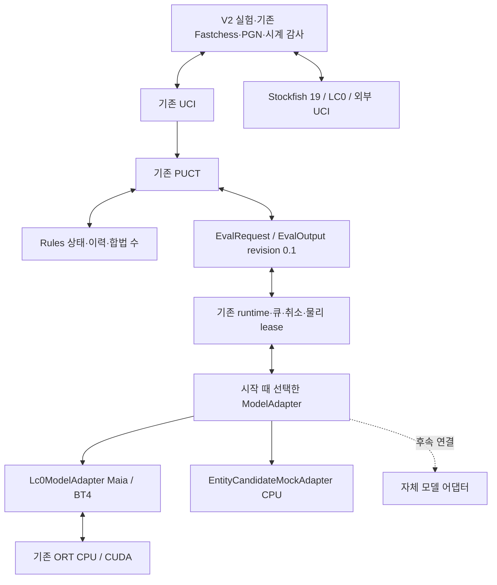

# 모델 어댑터와 외부 UCI 교체 경계

PR #20 통합 `9e450d5325a51b570e72472efd54368a36dab81b`를 분리 전 기준으로 등록한다.
작업은 `feature/model-adapter-external-uci`와 Draft PR #22에서 공유한다. 공통 평가 계약
revision `0.1`, Rules, PUCT, runtime의 취소·세대·물리 수명은 유지한다. 구현 제공,
CPU 검사, 실제 신경망 수치 검사, 성능 회귀, 외부 대국은 별도 인수다.

## 제품 경계

`rz-eval::model_adapter::ModelAdapter`의 준비 입력·batch·raw 출력은 associated type이다.
모든 모델에 LC0의 112×64 입력이나 1858 policy 배열을 강제하지 않는다. Rules 상태·
이력·합법 수에서 실제 입력 식별값을 계산하고, 출력은 요청의 합법 수 **순서** policy와
차례 관점 WDL로 검사·변환한다. 선언된 자원 예약과 실제 peak/할당 한도를 구분한다.

`adapters/lc0/`가 입력 이력·좌표·승격 policy·softmax·head/shape·자산 검증·모델별
session 조건을 소유한다. Maia1900와 BT4-it332 프로필을 포함한다. 기존 공개 경로와
`ClassicalProjection` 별칭은 호환용으로 유지하며 코드 이동으로 의미 hash를 바꾸지 않는다.
구현 출처는 V2 `adapter_implementation_sha256`와 binary/source pin으로 별도 기록한다.

`NativeWorkerOwner<A>`와 `NativeRuntimeBackend<C,A>`를 준비 batch 타입에 대해 일반화한다.
bootstrap 한 번에 모델을 선택하며 노드마다 목록 조회나 입력 추가 복제를 하지 않는다.
기존 단일 물리 worker·lease, deadline·generation·예약·취소, 완료 후 buffer 재사용과
불명 완료 격리를 유지한다. 논리 취소가 session·입력·출력의 해제 권한을 주지 않는다.
스트리밍 검증, 직렬화 버퍼 조기 해제, 공유 runtime cache, 기존 독립 buffer 옵션,
snapshot cache hint와 저장소 정리 조건을 보존한다.

`EntityCandidateMockAdapter`는 entity·상태·known history·순서 있는 합법 후보에서
후보 수만큼의 logits와 WDL을 반환한다. 후보·mask·순서·네 승격·이력은 입력 식별에
포함되며 준비 입력은 외부에서 변경할 수 없다. CPU mock은 **B1만** 허용하고 LC0 raw
head 재사용/서로 다른 후보 목록의 batch 권한을 상속하지 않는다. 실제 자체 신경망이나
강도 결과가 아니다. `--cpu-mock --model-adapter=entity-candidate-mock`으로 기존 UCI·
runtime·탐색을 통과한다. 기존 mock/native CLI 기본값은 LC0다.

캐시 키는 실제 입력·이력·모델·encoding·backend·정밀도를 구분한다. 후보가 입력이면
후보·mask·순서도 포함한다. 기존 LC0 전체 raw head 재사용·요청별 합법 수 투영은 유지한다.
cache hit, 물리 NN 입력 완료, 탐색 소비 평가와 방문을 구분한다.

## V2 비교 명세

`RunManifestV2`와 `LockedManifestV2`는 별도 codec/domain이다. V1 parser·canonicalization·
digest·기록을 자동 변환하지 않는다. V2 lock도 `execution_ready=false`이며 메타데이터
잠금 자체가 실행·검증 성공을 뜻하지 않는다.

| 비교 | 고정·허용 변화 | 분류 |
|---|---|---|
| Runtime | 모델 구성·weights·입력·탐색·backend·정밀도 고정, 선언한 runtime 변화 | E |
| AdapterEquivalence | 모델·입력 의미·runtime·탐색·backend·정밀도·batch 고정, 어댑터 구현/연결만 변화 | E |
| InternalWeights | 동일 실행 파일·구조·encoding·head·adapter 의미·backend·정밀도·탐색·runtime, weights만 변화 | A |
| InternalModel | Rules·평가 절차·탐색·runtime·시계·자원 고정, 모델 구성과 필요한 실행 차이를 사전 선언 | A |
| InternalSearch | 모델·weights·runtime 고정, 선언한 탐색 변화 | S |
| ExternalEngine | 완전 시작 상태·색 교환·시계·실패·집계 고정, 양쪽 엔진·옵션·자산·자원 차이를 기록 | 외부 비교 |

Runtime·InternalSearch 코드 실험과 adapter/model 비교에는 다른 실행 파일이 필요할 수
있다. target·compiler·build mode·ISA는 고정하며 실제 변경 집합과 `declared_changes`를
대조한다. InternalModel은 선언한 구성 전체의 효과다. 개별 요소에는 별도 통제 비교가
필요하다. batching은 S 실험이며 현재 V2 native 실행 recipe는 기존 B1을 사용한다.

RoveZero 항목은 모델 구성·adapter 의미/구현·encoding·head·weights·backend·정밀도·
탐색/runtime·native launch를 포함한다. ExternalUci 항목은 실제 binary·버전·소스/권리·
인수·옵션·필요 자산·handshake 한도를 포함한다. 외부 엔진에 가상의 weights나 RoveZero
policy/WDL/ORT attestation을 요구하지 않는다. 인수/옵션의 `{{asset:0}}` 참조는 검증된
private asset pin에 연결한다. 첫 recipe는 공통으로 정리된 runner 환경을 상속하며 임의의
엔진별 환경 override를 조용히 적용하지 않는다. 미구현 launch, 미지원 backend 또는 서로
다른 native CUDA bundle을 이 recipe에서 실행하지 않는다.

## Stockfish 19와 대국

[공식 sf_19 릴리스](https://github.com/official-stockfish/Stockfish/releases/tag/sf_19)의
source `edb0d9db6731067ec50ce619ff372b463bc4dd5d`와 Linux x86-64 universal을 사용한다.
universal은 실행 시 CPU 기능을 선택한다. compiler 출력과 확인 가능한 ISA를 기록하며
불명인 실제 선택은 unknown이다. archive checksum과 설치 ELF SHA-256은 별도로 등록한다.
`scripts/install_stockfish19.py`는 추출 경로·종류·파일 수·크기를 제한한다. 저장소 밖의
GPL 배포물/내장 NNUE와 원본 소스 출처를 RoveZero MIT 코드와 분리한다.

[sf_19 옵션 선언](https://github.com/official-stockfish/Stockfish/blob/sf_19/src/engine.cpp)에
따라 Threads=2, Hash=256, NumaPolicy=none, Ponder=false, MultiPV=1, Skill Level=20,
UCI_LimitStrength=false, UCI_Chess960=false, Move Overhead=10, nodestime=0,
SyzygyProbeLimit=0, 기본 내장 NNUE를 사용한다. 광고된 이름·옵션·범위와 요청값을 대조한다.
지원 여부·송신·readyok barrier와 실제 옵션 값은 분리한다. UCI에 일반적인 readback이
없으므로 readyok만으로 모든 옵션의 실제 적용을 입증했다고 표시하지 않는다.

`stockfish_check` CPU example은 pin·광고·옵션·readiness·합법 bestmove·stop·quit·
process group 종료를 독립 검사한다. 대국은 기존 Fastchess·입력 snapshot·process 관리·
Rules PGN 감사·벽시계 차감/증분/시간패 감사·정리를 재사용한다. 외부 엔진에 native
ORT/CUDA/attestation 인수를 전달하지 않는다. V2 진입점은 `model-pair lock INPUT_JSON
NEW_LOCK_JSON`과 `model-pair execute LOCK_JSON ASSET_ROOT OUTPUT_ROOT UNIQUE_LABEL`이다.
모든 경로는 절대 경로이고 결과는 Git 밖에 둔다. 실제 affinity와 cgroup memory.high/max/
swap을 명세와 대조한다. CPU preflight와 게임 process 증거는 구분한다. 두 판의 RoveZero
CUDA session **2개**와 외부 UCI exit **2개**를 검사하며 내부 V1의 native 4개 조건을
외부 대국에 적용하지 않는다.

첫 pilot은 BT4·FP32·TF32 off·HistoryFill No·temperature 1·B1·4096 simulation 상한·
기존 PUCT·visits와 Stockfish 위 옵션이다. 표준 startpos의 흑백 교환 1쌍/2판, seed 1,
120초+1초 피셔, 최대 256 ply, 전체 900초+정리 30초다. 동시 대국 1개, 게임마다 재시작,
ponder·평가 기반 조기 판정 off다. Stockfish CPU와 RoveZero CPU+RTX 4050의 자원 차이를
선언한다. PGN에 백/흑 구성·실제 시계·결과·종료 이유를 남기고 크래시·불법 수·시간패와
인프라 실패를 구분한다. 두 판으로 Elo나 모델 승격을 확정하지 않는다.

## 인수와 복구

1. 기존 CPU/mock·UCI·수명·feature 검사와 entity 입력/후보 head, 네 승격·흑백 WDL·
   다른 이력/후보 순서·실패·취소·늦은 결과·중복 backup을 확인한다. CPU binding과
   V1 codec은 보존한다. 기본 빌드에 Python/GPU를 필수화하지 않는다.
2. Maia/BT4 독립 참조와 실제 Rules 경로를 별도 실행한다. No/Repeat, 입력 f32 byte 일치,
   logits 절대 1e-4/상대 1e-3, legal policy/WDL 절대 1e-4를 검사한다. `maia_check
   --single-only`는 명시적인 B1 수치 검사이며 큰 batch나 benchmark를 함께 실행하지 않는다.
3. 분리 전/후 binary·source·compiler·feature·자산을 먼저 등록한다.
   `benches/runtime/adapter_regression.py`는 startpos와 지정 Ruy Lopez 16-ply를 순차 처리하고
   매 입력을 새 게임으로 초기화한다. 입력당 4096 simulation, 실행당 180초+정리 30초,
   전체 3600초다. A/A 3쌍의 쌍별/전체 편차가 5% 이하일 때만 교차 순서 A/B 5쌍을 실행한다.
   준비/ready·검색·drain·전체와 fresh cgroup memory.peak를 기록한다. 각 유효 쌍의
   T_B/T_A≤1.05 **및** P_B/P_A≤1.05를 요구한다. 작업량·결과·peak 불명이나 수명 실패는
   HOLD다. NN-backed 8192 simulation와 추가 root 2개의 소비를 영수증으로 대조하며
   다른/종료 작업을 조용히 대체하지 않는다. 같은 등록 비교의 합계를 누적하되 다른 과거
   E 실험을 분모에 섞지 않는다. 기존 E 채택의 20% 메모리 절약 문턱과 구분한다.
4. 신경망 동등성과 회귀가 모두 통과한 뒤 외부 두 판을 실행한다. 서로 다른 엔진 nodes를
   같은 작업량으로 환산하지 않으며 물리 NN 완료와 탐색 소비를 분리한다.
5. CPU CI·GPU 수치·회귀·외부 UCI/대국을 각각 인수한다. 첫 할당·CUDA·물리 완료 실패에서
   후속 GPU 실행을 중단하고 자료를 보존한다. 복구는 등록된 A와 기존 V1 경로다.

RTX 4050 6GB·WSL Ubuntu, 실제 affinity 2개, memory.high=6GiB, memory.max=12GiB,
swap=0을 사용한다. `bounded_local.py`는 정상 quit/drain을 본 실행 예산에 포함하고 실패
정리를 총 30초로 제한한다. 정확한 자식과 자신의 새 cgroup만 종료하며 비어 있음/reap
확인 후 자신의 tmp만 정리한다. 자료는 보존하고 미관측 VRAM/Windows commit peak는
unknown이다. 별도 cloud 비용·학습·정밀도/batch 정책·backend 변경·session 공유는 제외한다.
